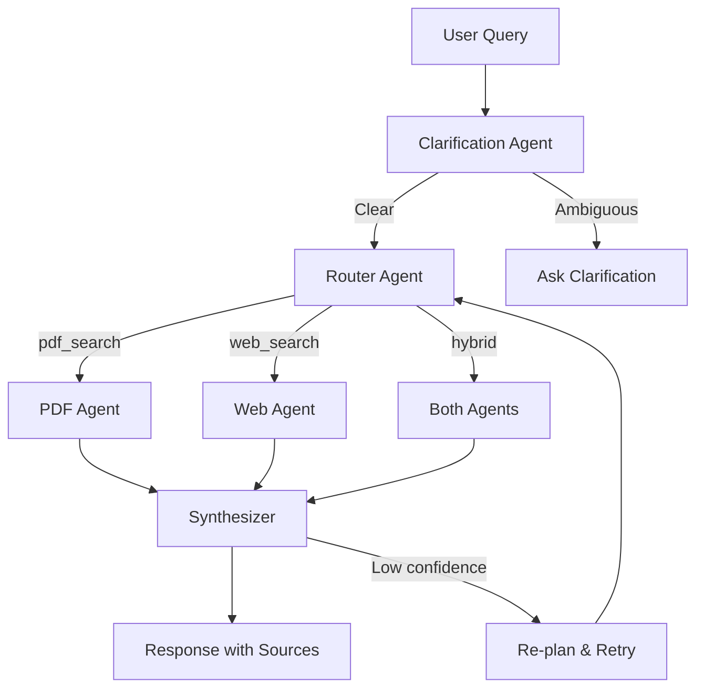

# 📄 Chat with PDF

A production-ready **RAG (Retrieval-Augmented Generation)** system for conversational AI with PDF documents. Built with FastAPI, LangGraph multi-agent architecture, and ChromaDB vector storage.

## ✨ Features

| Feature                  | Description                                                                      |
| ------------------------ | -------------------------------------------------------------------------------- |
| 📄 **PDF Ingestion**      | Upload and process PDFs with automatic chunking and embedding                    |
| 🤖 **Multi-Agent System** | LangGraph orchestrator with specialized agents (Clarification, Router, PDF, Web) |
| 🔍 **Semantic Search**    | ChromaDB vector store for high-quality similarity search                         |
| 🌐 **Hybrid Search**      | Combine PDF knowledge with real-time web search via Tavily                       |
| 💬 **Session Memory**     | Persistent conversation history across sessions                                  |
| 🔄 **Auto Re-planning**   | Intelligent retry with fallback when initial retrieval fails                     |
| 🐳 **Docker Ready**       | Multi-stage Dockerfile with docker-compose for easy deployment                   |

## 🏗️ Architecture



**Agent Workflow:**
1. **Clarification Agent** - Detects vague/ambiguous queries and requests clarification
2. **Router Agent** - LLM-powered routing to PDF, Web, or Hybrid search based on query intent
3. **PDF Agent** - Retrieves and synthesizes answers from uploaded PDF documents
4. **Web Agent** - Fetches real-time information via Tavily search
5. **Synthesizer** - Combines results into coherent, cited responses

## 🛠️ Tech Stack

- **Framework:** FastAPI
- **LLM Orchestration:** LangChain + LangGraph
- **Vector Database:** ChromaDB
- **LLM Providers:** OpenAI / OpenAI-compatible APIs
- **Web Search:** Tavily
- **Package Manager:** uv

## 🚀 Quick Start

### Prerequisites

- Python 3.12+
- [uv](https://docs.astral.sh/uv/) package manager
- OpenAI API key

### Installation

```bash
# Clone and enter the project
cd pdf-chat

# Install dependencies
uv sync

# Configure environment
cp .env.example .env
```

### Configuration

Edit `.env` with your API keys:

```env
# Required
OPENAI_API_KEY=sk-your-openai-key

# Optional: Custom OpenAI-compatible endpoint
OPENAI_API_BASE=https://api.openai.com/v1

# Optional: Web search
TAVILY_API_KEY=tvly-your-tavily-key

# Model settings
DEFAULT_LLM_MODEL=gpt-4o-mini
EMBEDDING_MODEL=text-embedding-3-small
```

### Run the Server

```bash
# Development
uv run uvicorn app.main:app --reload --port 8000

# Production
uv run uvicorn app.main:app --host 0.0.0.0 --port 8000
```

🌐 **API Docs:** http://localhost:8000/docs

## 📡 API Reference

### Chat

```bash
# Send a message
curl -X POST http://localhost:8000/api/v1/chat \
  -H "Content-Type: application/json" \
  -d '{"message": "What is text-to-SQL?"}'

# With session ID for conversation memory
curl -X POST http://localhost:8000/api/v1/chat \
  -H "Content-Type: application/json" \
  -d '{"message": "Tell me more", "session_id": "my-session"}'
```

### Documents

```bash
# Upload a PDF
curl -X POST http://localhost:8000/api/v1/documents/upload \
  -F "file=@document.pdf"

# Search documents
curl -X POST http://localhost:8000/api/v1/documents/search \
  -H "Content-Type: application/json" \
  -d '{"query": "machine learning", "k": 5}'

# Delete all documents
curl -X DELETE http://localhost:8000/api/v1/documents/collection
```

### Sessions

```bash
# List all sessions
curl http://localhost:8000/api/v1/sessions

# Get session history
curl http://localhost:8000/api/v1/sessions/{session_id}

# Clear session memory
curl -X DELETE http://localhost:8000/api/v1/sessions/{session_id}

# Delete session permanently
curl -X DELETE http://localhost:8000/api/v1/sessions/{session_id}/permanently
```

### Health Check

```bash
curl http://localhost:8000/health
```

## 📥 PDF Ingestion

### Via Script

```bash
# Single file
uv run python scripts/ingest_pdfs.py path/to/document.pdf

# Multiple files
uv run python scripts/ingest_pdfs.py doc1.pdf doc2.pdf doc3.pdf

# Directory (recursive)
uv run python scripts/ingest_pdfs.py --pdf-dir path/to/pdf/directory
```

### Via API

```bash
curl -X POST http://localhost:8000/api/v1/documents/upload \
  -F "file=@document.pdf"
```

## 🐳 Docker Deployment

### Build & Run

```bash
# Build and start
docker compose up -d --build

# View logs
docker compose logs -f

# Stop
docker compose down
```

### Environment Variables

Pass API keys via `.env` file or environment:

```yaml
# docker-compose.yml already configured to use .env file
env_file:
  - .env
```

### Persistence

Data is persisted in `./data` directory:
- `./data/chroma` - Vector database
- `./data/*.pdf` - Uploaded PDFs

## 📁 Project Structure

```
.
├── app/
│   ├── agents/              # LangGraph agents
│   │   ├── clarification_agent.py
│   │   ├── router_agent.py
│   │   ├── pdf_agent.py
│   │   ├── web_agent.py
│   │   ├── rag_agent.py
│   │   └── orchestrator.py  # Main workflow
│   ├── api/                 # FastAPI routes
│   │   ├── chat.py
│   │   ├── documents.py
│   │   ├── sessions.py
│   │   └── health.py
│   ├── core/                # Config & dependencies
│   ├── db/                  # Vector store & session memory
│   ├── models/              # Pydantic schemas
│   ├── services/            # PDF ingestion, web search
│   └── main.py              # Application entry point
├── scripts/
│   └── ingest_pdfs.py       # Batch PDF ingestion
├── data/                    # PDFs and ChromaDB storage
├── pyproject.toml
├── Dockerfile
├── docker-compose.yml
└── README.md
```

## 🧪 Development

```bash
# Install dev dependencies
uv sync --dev

# Run tests
uv run pytest

# Lint code
uv run ruff check .

# Format code
uv run ruff format .
```

## 📄 License

MIT
